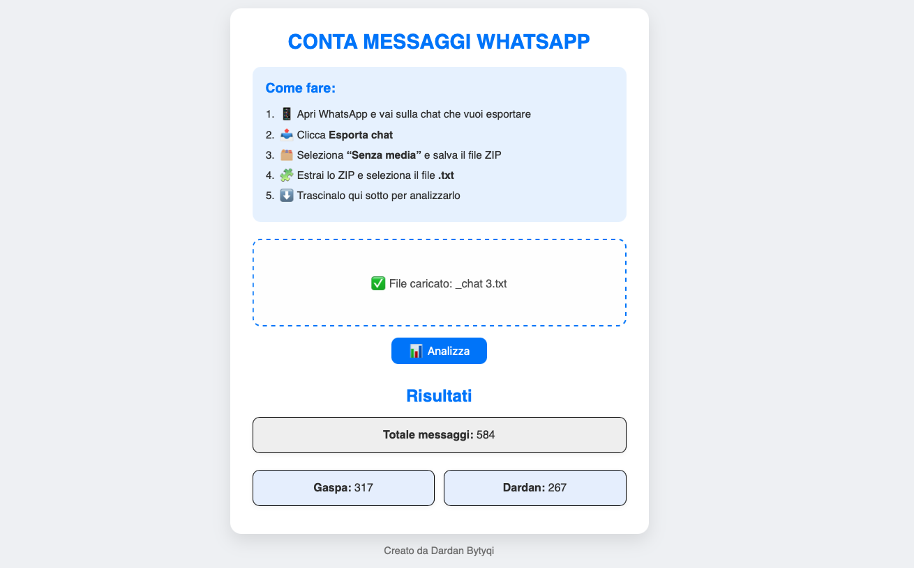

# Conta Messaggi WhatsApp 📊

Un tool semplice per contare i messaggi da una chat WhatsApp esportata.

 

## Come Usare 🛠️

1. **Esporta la chat** da WhatsApp:  
   `Altro → Esporta chat → Senza media`
2. **Carica il file .txt** nell'area dedicata
3. **Clicca "Analizza"** per vedere le statistiche

## Tecnologie Usate 💻
- HTML5
- CSS3
- JavaScript

## Provalo 🌐
[progetto online](https://tuo-username.github.io/conta-messaggi-whatsapp/)

